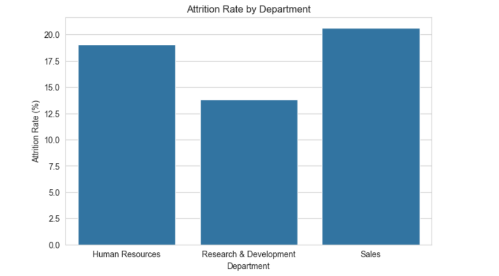
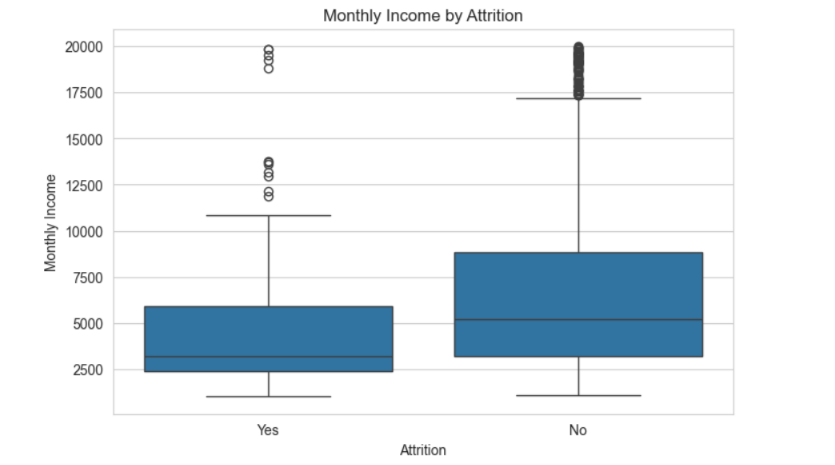
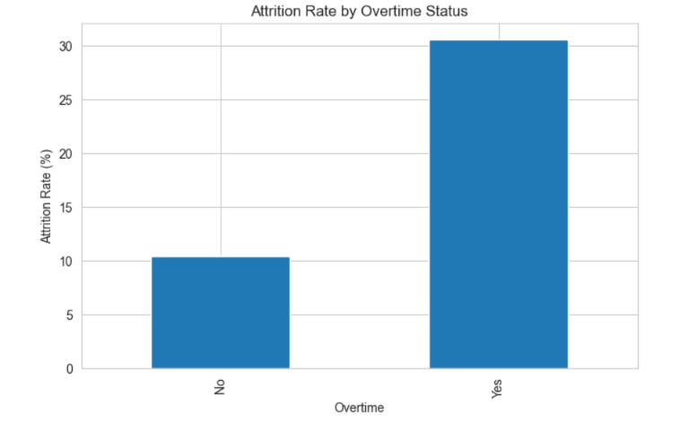
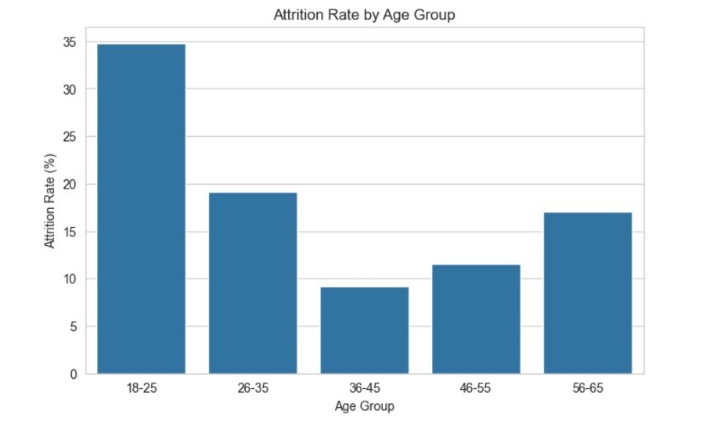
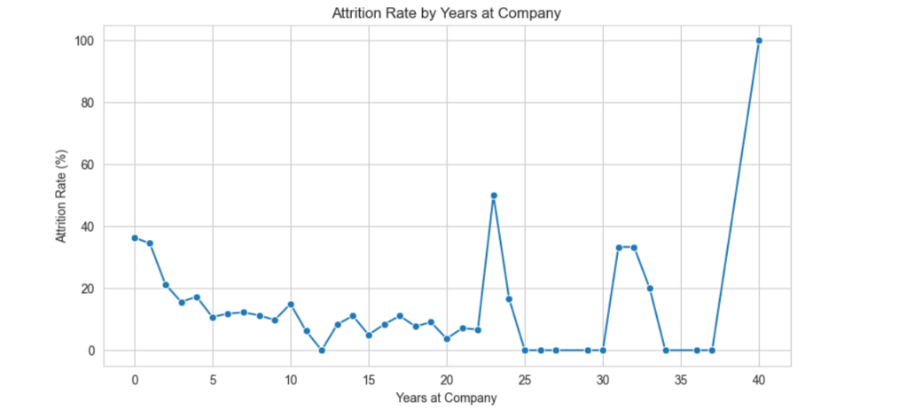
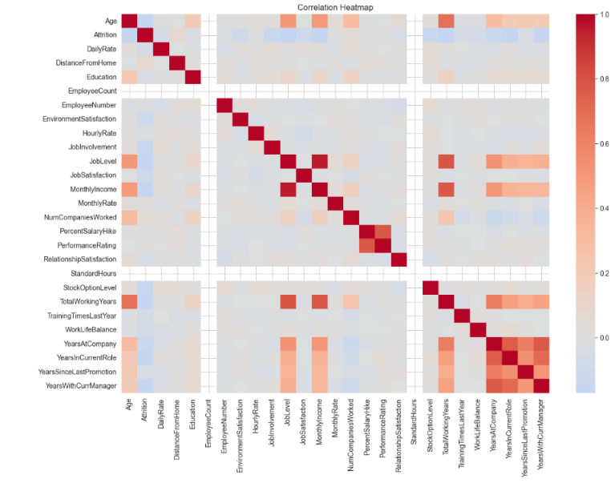

# HR Employee Attrition Analysis

## Overview
Analyzed IBM HR Analytics data (1,470 employees, 35 features) to identify
why employees leave and which groups are at highest attrition risk.
Delivered 5 data-backed HR recommendations.

**Tools:** Python, Pandas, Matplotlib, Seaborn, SQL, Tableau

---

## Key Findings

- Sales department attrition (21%) is 1.56x higher than R&D (13.5%)
- Overtime employees are 2.8x more likely to quit than non-overtime employees
- Employees aged 30 and under have a 26% attrition rate vs 11.46% for 45+
- Churned employees earned 4787/month vs 6832/month for retained employees
- Attrition peaks at initial years i.e 18-25 — the highest-risk onboarding window

---

## Visualizations

### 1. Attrition by Department

### 2. Monthly Income vs Attrition

### 3. Overtime Impact

### 4. Age Distribution

### 5. Years at Company

### 6. Correlation Heatmap

---

## Business Recommendations

1. **Sales retention is critical** — attrition 20.6% vs industry avg 10-15%
2. **Cap mandatory overtime** — overtime employees are 2.8x more likely to leave than the non-overtime ones.
3. **Invest in 0-2 year onboarding** — 43.9% churn in first 2 years
4. **Salary benchmarking** — bottom 25% earners drive disproportionate attrition
5. **Young talent program** — employees under 30 need structured growth paths

---

## Project Structure
| File | Description |
|------|-------------|
| `HR_Attrition_EDA.ipynb` | Full analysis notebook with all visualizations |
| `WA_Fn-UseC_-HR-Employee-Attrition.csv` | Dataset |
| `viz1` to `viz6` `.png` | Individual chart exports |